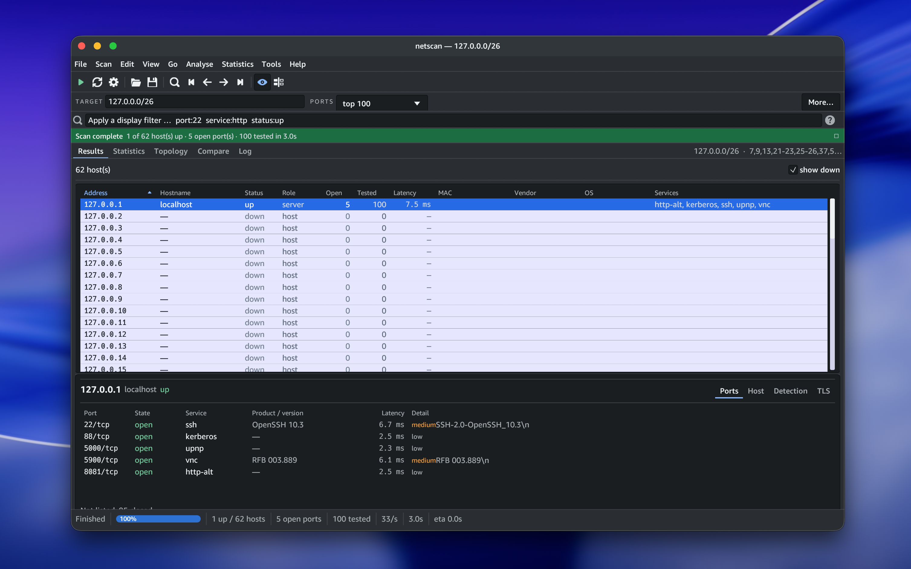
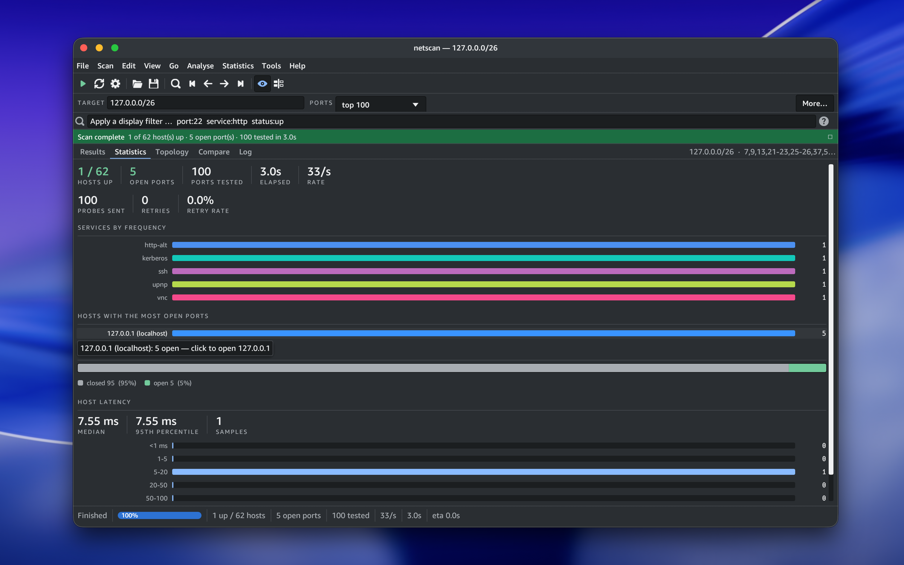
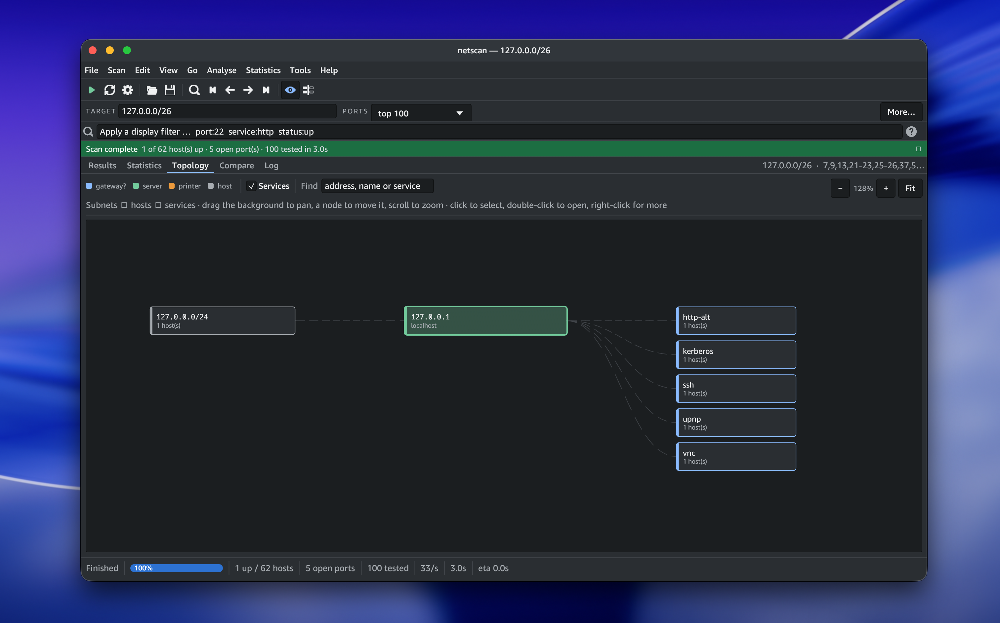

# netscan

A network scanner and analyser with a command line tool and a native desktop application, built on one shared engine in Rust.

[](https://github.com/sssst9s/netscan/actions/workflows/ci.yml)
[](LICENSE)

netscan finds which hosts on a network are up, which ports they have open, what is running on those ports and what the machine appears to be. It reads results back in and tells you what changed since last time.



## Contents

- [Install](#install)
- [Quick start](#quick-start)
- [What it does](#what-it-does)
- [The desktop application](#the-desktop-application)
- [Output formats](#output-formats)
- [Authorised use](#authorised-use)
- [Documentation](#documentation)
- [Building from source](#building-from-source)
- [Licence](#licence)

## Install

### Homebrew

```sh
brew tap sssst9s/netscan https://github.com/sssst9s/netscan.git
brew install netscan
```

### Install script

```sh
curl -fsSL https://raw.githubusercontent.com/sssst9s/netscan/main/install.sh | sh
```

The script downloads the release build for your platform and puts `netscan` in `/usr/local/bin`. Set `NETSCAN_INSTALL_DIR` to choose somewhere else.

### Prebuilt binaries

Download an archive for your platform from the [releases page](https://github.com/sssst9s/netscan/releases), unpack it and move `netscan` onto your `PATH`.

### Cargo

```sh
cargo install --git https://github.com/sssst9s/netscan netscan-cli
```

Full instructions, including the desktop application and the optional raw socket build, are in [INSTALL.md](INSTALL.md).

## Quick start

```sh
netscan 192.168.1.1                       # one host, top 100 ports
netscan 192.168.1.0/24                    # a whole network
netscan example.com -p 22,80,443          # named ports
netscan --top-ports 1000 -sV target       # with service and version detection
netscan --local --os-detection            # inventory the network you are on
netscan --json -o scan.json target        # machine readable results
netscan --compare before.json after.json  # report what changed
netscan --watch 5m 192.168.1.0/24         # rescan on an interval
```

Run `netscan --help` for the full option list, or `netscan --list-profiles` for the built in profiles.

## What it does

**Host discovery.** ICMP echo, TCP ping and ARP on directly attached IPv4 networks. Skip it with `--no-discovery` when a network drops probes.

**Port scanning.** TCP connect by default, which needs no privileges. Half open SYN scanning through `--syn` on builds with the `raw` feature. UDP through `--udp`.

**Service and version detection.** Banner reading plus a probe database, graded by how intrusive each probe is so you can cap it with `--max-intrusiveness`.

**Operating system inference.** Assembled from TTL, TCP window behaviour, service banners and MAC vendor. Every inference carries its evidence and a confidence level, and is presented as a guess rather than a fact.

**TLS inspection.** Negotiated version, cipher and certificate details including expiry and subject alternative names.

**Targets.** Single addresses, hostnames, CIDR blocks, dash ranges and files of any of those, over IPv4 and IPv6, with exclusion lists.

**Comparison and monitoring.** `--compare` diffs two saved scans. `--watch` rescans on an interval and reports changes as they happen. `--inventory` maintains a record of what has been seen on a network over time.

**Adaptive timing.** Concurrency and timeouts follow observed latency and loss, within the bounds set by `--timing`, `--max-rate` and `--concurrency`.

## The desktop application

`netscan-gui` is a native application built on the same engine, so a scan run in the interface and a scan run at the command line produce identical results. It reads and writes the same JSON files.



The results view is a sortable host list over a detail pane, with a Wireshark style display filter. Rows are selectable and carry context menus for copying, filtering and rescanning. The statistics view summarises services, hosts and port states, and every bar is a link into the filtered result list.



The topology view groups hosts by the subnet they were found in and joins them to the services they offer. Nodes can be dragged, the graph pans and zooms, and hovering follows one thread through it. It shows only what was observed: a port scanner sees hosts, not switch fabric, so nothing here is invented.

## Output formats

| Format | Flag | Use |
| --- | --- | --- |
| Text | default | reading in a terminal |
| JSON | `--json` | one document per scan, for tooling |
| JSON Lines | `--jsonl` | one host per line, for streaming |
| CSV | `--csv` | spreadsheets |
| XML | `--xml` | existing pipelines |

Writing to a file with `-o` infers the format from the extension unless one is given explicitly.

## Authorised use

Port scanning a system you do not own or have written permission to test may be unlawful where you are, and may breach the terms of service of the network you are on. netscan is for networks you are responsible for and systems you have been authorised to test.

The defaults are deliberately conservative: bounded concurrency, a capped probe rate, a limit on how many addresses a scan may expand to, and a refusal for very large scans unless you pass `--yes`. See [SECURITY.md](SECURITY.md).

## Documentation

| File | Contents |
| --- | --- |
| [INSTALL.md](INSTALL.md) | every installation route, and the raw socket build |
| [USAGE.md](USAGE.md) | the command line in depth, with worked examples |
| [CONFIGURATION.md](CONFIGURATION.md) | `netscan.toml`, profiles and defaults |
| [OUTPUT.md](OUTPUT.md) | the shape of every output format |
| [GUI.md](GUI.md) | the desktop application, and why it is built the way it is |
| [ARCHITECTURE.md](ARCHITECTURE.md) | how the engine is put together |
| [CONTRIBUTING.md](CONTRIBUTING.md) | working on netscan |
| [SECURITY.md](SECURITY.md) | responsible use and reporting a vulnerability |
| [CHANGELOG.md](CHANGELOG.md) | what changed in each release |

## Building from source

Requires Rust 1.83 or later.

```sh
git clone https://github.com/sssst9s/netscan.git
cd netscan
cargo build --release
```

The binaries land in `target/release`: `netscan` for the command line and `netscan-gui` for the desktop application.

```sh
cargo test --workspace          # 750 tests
cargo clippy --all-targets      # no warnings
cargo fmt --all --check
```

## Licence

MIT. See [LICENSE](LICENSE).

Amazon Ember, bundled for the desktop application, and the Blueprint icons, vendored under `assets/blueprint-icons`, carry their own licences. Both are recorded in [INSTALL.md](INSTALL.md).
